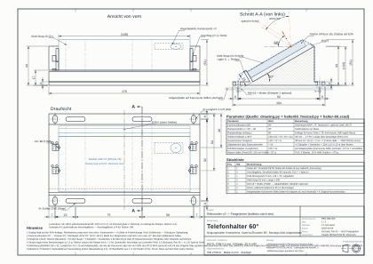
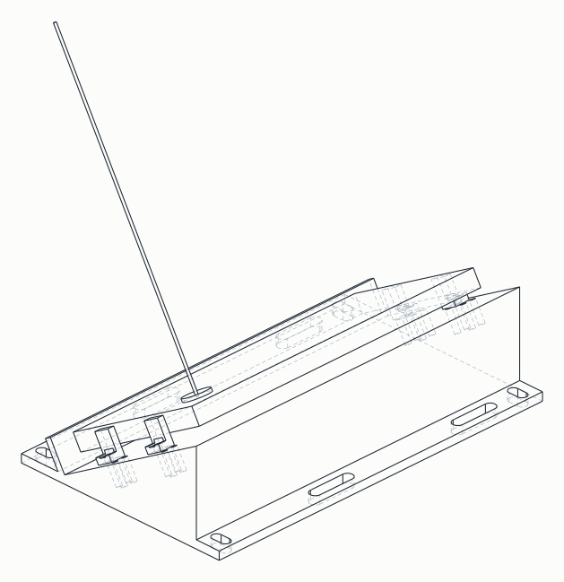
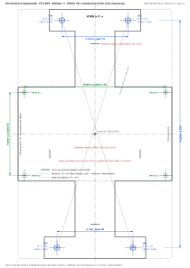
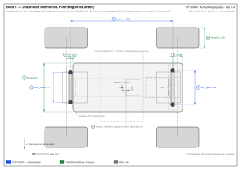

<div align="center">

# 🏀 rebounder

**An autonomous robot that catches basketballs — built from scratch, hardware to AI**

Real-time ball detection & trajectory estimation from noisy camera data →
an RC car that intercepts and collects the ball.

*Why chase your own rebounds?*

</div>

---

## What it is

A fully autonomous rebound assistant: watch the shot, predict where the ball
lands, drive there, catch it, bring it back. No cloud, no external tracking —
everything runs on-board.

## High-level architecture

```
camera ──► ball detection ──► trajectory estimation ──► catch-point prediction
                                                              │
              ESP32 radio bridge ◄── drive commands ◄────────┘
                       │
                autonomous RC car 🏎️
```

- **Perception** — real-time ball detection in noisy frames
- **Prediction** — trajectory estimation (least-squares fitting) from partial flight data
- **Strategy** — Monte-Carlo sweeps over catch-rate to pick intercept points,
  not just the theoretical landing spot
- **Control** — RC car + ESP32 radio bridge
- **Companion app** — Flutter tracking app for stats and debugging
- **Hardware** — custom mounting parts constructed in **FreeCAD with LLM-assisted
  sketches** (AI-generated geometry → parametric CAD → 3D print)


## Repo contents (public preview)

| Path | What it is |
|---|---|
| `src/engine.js` | Pure math engine (no DOM, runs in Node & browser): least-squares state estimation, crossing prediction, residual gate (maneuver detection), catch planning with bounce anticipation, a/v-limited actuator controller |
| `src/sensor.js` | Camera sensor model: FOV with tilt/pan, anisotropic noise, dropouts, false measurements, detection latency |
| `src/sim.js` | Simulation: ballistics, scenarios (normal/bounce/spring/float), sensor emulation, canvas rendering |
| `tools/sweep-basket.js` | Headless Monte-Carlo sweep: catch-rate over parameter configurations |
| `tools/golden-dart-*.js` | Golden-shot analysis tools: weighted fit, residual gate, catch planner, measurement covariance, ack travel time |
| `test/` | Node tests (`node --test`, zero dependencies), deterministic seeded RNG |
| `firmware/esp32-bridge/` | ESP32 radio bridge (Arduino): WiFi-AP + UDP → 2× 50 Hz RC-PWM, arming + failsafe |
| `hardware/halter-60/` | 📐 Full engineering documentation of a camera-phone mount: FreeCAD parametric script (`halter60_freecad.py`) + native CAD file (`.FCStd`) + **print-ready STLs** (holder 170×104×44 mm, stop ×4) + **dimensioned A3 technical drawing** (`halter-60.pdf`, 1:1 scale, ISO projection) + isometric view + 1:1 drilling template (`bohrschablone-adapter.pdf`) + measurement sheet for the RC chassis (`aufmass-kf10.pdf`) — sketches and construction done with **LLM-assisted design**, verified and printed |


## The hardware part — sketch to print

The phone mount for the on-board camera was designed with **LLM-assisted sketches,
then properly constructed in FreeCAD** — parametric, dimensioned, and printed:

| Technical drawing (A3, 1:1) | Isometric assembly |
|:---:|:---:|
|  |  |

| 1:1 drilling template | Chassis measurement sheet |
|:---:|:---:|
|  |  |

**Print files:** [`halter-60-holder.stl`](hardware/halter-60/halter-60-holder.stl) (170 × 104 × 44 mm, watertight-checked) · [`halter-60-stop.stl`](hardware/halter-60/halter-60-stop.stl) (×4) · native CAD: [`halter-60.FCStd`](hardware/halter-60/halter-60.FCStd)

Full documentation in [`hardware/halter-60/`](hardware/halter-60/) — generators included, everything reproducible from one shared parameter block.

Not public (yet): detector training, labeled datasets, app internals, build logs.

## Run it

```bash
# simulation in the browser
python3 -m http.server 8642   # open http://127.0.0.1:8642

# tests (Node >= 18, no dependencies)
node --test test/
```

## Status

Ongoing private build — this page is the public preview. Detailed build logs,
the perception stack, and the simulation engine stay private while the project
matures. Photos and videos as they become shareable.

## Why it's interesting

It's a small, honest version of a hard problem: perception → prediction →
autonomous action in the physical world, on a budget, fully self-built —
including the AI-assisted construction of its own hardware.

---
*Built by [Marvin Mouroum](https://github.com/marvinmouroum) — mechanical
engineer turned AI engineer.*
